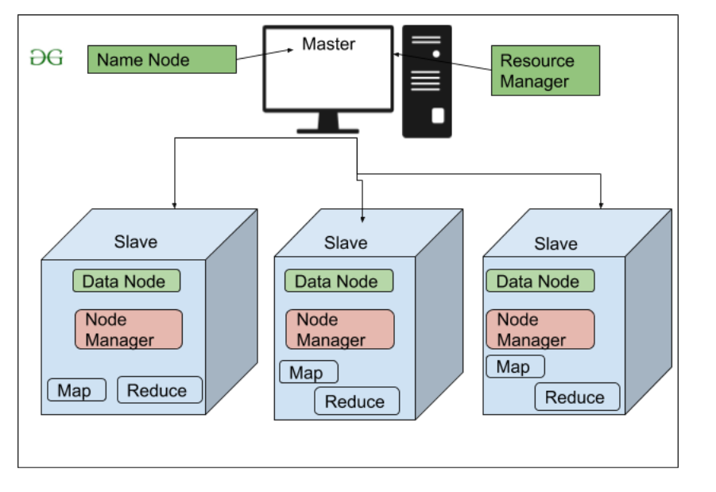

# Hadoop
Hadoop is a framework permitting the storage of large volumes of data on node systems. The Hadoop architecture  allows parallel processing of data using several components:

- Hadoop HDFS to store data across slave machines
- Hadoop YARN for resource management in the Hadoop cluster
- Hadoop MapReduce to process data in a distributed fashion
- Zookeeper to ensure synchronization across a cluster

## HDFS

The **Hadoop Distributed File System** (HDFS) is Hadoop’s storage layer. Housed on multiple servers, data is divided into blocks based on file size. These blocks are then randomly distributed and stored across slave machines. There are three components of the Hadoop Distributed File System:  

- NameNode (a.k.a. masternode): Contains metadata in RAM and disk
- Secondary NameNode: Contains a copy of NameNode’s metadata on disk
- Slave Node: Contains the actual data in the form of blocks

<p align="center">
    
</p>


### NameNode
NameNode is the master server. In a non-high availability cluster, there can be only one NameNode. In a high availability cluster, there is a possibility of two NameNodes, and if there are two NameNodes there is no need for a secondary NameNode. 
NameNode holds metadata information on the various DataNodes, their locations, the size of each block, etc. It also helps to execute file system namespace operations, such as opening, closing, renaming files and directories.

### Secondary NameNode
The secondary NameNode server is responsible for maintaining a copy of the metadata in the disk. The main purpose of the secondary NameNode is to create a new NameNode in case of failure. In a high availability cluster, there are two NameNodes: active and standby. The secondary NameNode performs a similar function to the standby NameNode.

<p align="center">
    
</p>


### Datanodes
Datanodes store and maintain the blocks. While there is only one namenode, there can be multiple datanodes, which are responsible for retrieving the blocks when requested by the namenode. Datanodes send the block reports to the namenode every 10 seconds; in this way, the namenode receives information about the datanodes stored in its RAM and disk.


## YARN
Hadoop YARN (**Yet Another Resource Negotiator**) is the cluster resource management layer of Hadoop and is responsible for resource allocation and job scheduling. Introduced in the Hadoop 2.0 version, YARN is the middle layer between HDFS and MapReduce in the Hadoop architecture. The elements of YARN include:

- ResourceManager (one per cluster)
- ApplicationMaster (one per application)
- NodeManagers (one per node)

<p align="center">
    
</p>

### Resource Manager
Resource Manager manages the resource allocation in the cluster and is responsible for tracking how many resources are available in the cluster and each node manager’s contribution. It has two main components:

- Scheduler: Allocating resources to various running applications and scheduling resources based on the requirements of the application; it doesn’t monitor or track the status of the applications
- Application Manager: Accepting job submissions from the client or monitoring and restarting application masters in case of failure

#### YARN Schedulers

The **Scheduler** is a critical component of the ResourceManager responsible for allocating cluster resources to running applications based on configured policies. It operates as a pure scheduler—it does not monitor application status or guarantee fault tolerance, focusing solely on resource allocation based on application requirements and cluster availability.

**Scheduler Responsibilities**:
- Allocate resources (containers) to applications based on scheduling policy
- Manage resource queues and application priorities
- Ensure fair or guaranteed resource distribution according to configured rules
- Maximize cluster utilization while respecting constraints
- Balance resource allocation across multiple tenants or teams

YARN provides three main scheduler types, each with different allocation strategies suitable for various use cases.

<p align="center">
    
</p>

##### FIFO Scheduler (First-In-First-Out)

The **FIFO Scheduler** is the simplest scheduling policy that processes applications in strict submission order.

**How It Works**:
- Applications are placed in a single queue
- Resources are allocated to the first application in the queue
- Once the first application's resource needs are satisfied (or it completes), the next application receives resources
- Purely sequential processing based on submission time

**Use Cases**:
- Single-user or single-team clusters
- Development and testing environments
- Simple workloads where job ordering is acceptable

**Advantages**:
- Simple to understand and configure
- Zero configuration required
- Predictable behavior

**Limitations**:
- Not suitable for shared/multi-tenant clusters
- Large, long-running jobs can monopolize all resources
- Small, high-priority jobs must wait for large jobs to complete
- Poor cluster utilization in multi-user environments
- No fairness guarantees

**Example Scenario**:
```
Queue: [Job A (Large, 100GB)] → [Job B (Small, 10GB)] → [Job C (Medium, 50GB)]

Job A gets all available resources first.
Job B and Job C must wait, even if Job B is small and urgent.
```

##### Capacity Scheduler

The **Capacity Scheduler** is designed for multi-tenant clusters where multiple organizations or teams share resources with guaranteed minimum capacities.

**How It Works**:
- Organizes resources into hierarchical queues (e.g., by team, department, or project)
- Each queue is guaranteed a minimum capacity (percentage of total cluster resources)
- Queues can use more than their allocated capacity if other queues have idle resources (elasticity)
- When the owning queue needs resources back, excess resources are reclaimed
- Within each queue, applications are typically scheduled using FIFO (configurable)

**Use Cases**:
- Multi-tenant enterprise clusters
- Organizations with multiple teams sharing infrastructure
- Environments requiring guaranteed minimum resources per team
- Production clusters with SLA requirements

**Advantages**:
- Guaranteed minimum capacity for each queue
- Elastic resource sharing when queues are idle
- Hierarchical queue organization for complex structures
- Prevents resource starvation for high-priority teams
- Supports queue-level access control and priorities

**Limitations**:
- Requires more configuration (queue setup, capacities)
- Less dynamic than Fair Scheduler
- Can be complex to tune for optimal utilization

**Configuration Properties**:

| Property | Description |
|----------|-------------|
| `yarn.resourcemanager.scheduler.class` | Set to `org.apache.hadoop.yarn.server.resourcemanager.scheduler.capacity.CapacityScheduler` |
| `yarn.scheduler.capacity.root.queues` | Comma-separated list of queue names |
| `yarn.scheduler.capacity.<queue>.capacity` | Guaranteed capacity percentage for a queue |
| `yarn.scheduler.capacity.<queue>.maximum-capacity` | Maximum capacity a queue can grow to (elasticity limit) |
| `yarn.scheduler.capacity.<queue>.user-limit-factor` | How much of the queue a single user can consume |

**Example Scenario**:
```
Root Queue (100%)
├── Engineering (60%)
│   ├── Development (30%)
│   └── Testing (30%)
└── Analytics (40%)

- Engineering guaranteed 60%, Analytics guaranteed 40%
- If Analytics is idle, Engineering can use up to 100%
- When Analytics needs resources, Engineering shrinks back to 60%
```

##### Fair Scheduler

The **Fair Scheduler** aims to provide all running applications with an approximately equal share of resources over time, ensuring fairness and preventing starvation.

**How It Works**:
- Dynamically allocates resources to ensure each application gets a fair share
- When only one application is running, it uses the entire cluster
- When new applications are submitted, resources are rebalanced to maintain fairness
- Supports hierarchical queues with configurable weights
- Can preempt (kill) containers from overallocated queues to reallocate to underallocated ones
- Fairness can be based on memory alone or both memory and CPU (Dominant Resource Fairness - DRF)

**Use Cases**:
- Shared clusters with unpredictable workloads
- Multi-user environments requiring fairness
- Clusters where preventing starvation is critical
- Environments with mixed interactive and batch workloads
- Default choice for small to medium-sized clusters

**Advantages**:
- Automatic fair distribution without manual capacity planning
- Prevents application starvation
- Dynamic resource rebalancing
- Supports preemption to enforce fairness
- Flexible with queue weights and priorities
- Good for mixed workloads (short queries + long batch jobs)

**Limitations**:
- Preemption can waste work if not tuned properly
- More complex internally than FIFO
- May require tuning for optimal performance
- Fair sharing might not align with strict SLA requirements

**Configuration Properties**:

| Property | Description |
|----------|-------------|
| `yarn.resourcemanager.scheduler.class` | Set to `org.apache.hadoop.yarn.server.resourcemanager.scheduler.fair.FairScheduler` |
| `yarn.scheduler.fair.allocation.file` | Path to fair scheduler XML configuration file |
| `yarn.scheduler.fair.preemption` | Enable/disable preemption (default: false) |
| `yarn.scheduler.fair.preemption.cluster-utilization-threshold` | Cluster utilization threshold to trigger preemption |
| `yarn.scheduler.fair.sizebasedweight` | Assign weights to applications based on size |

**Example Scenario**:
```
Initial State:
- Job A running, using 100% of resources

After Job B and Job C submit:
- Job A: 33% of resources (rebalanced)
- Job B: 33% of resources (new allocation)
- Job C: 33% of resources (new allocation)

Each application gets approximately equal share over time.
```

##### Scheduler Comparison

| Feature | FIFO Scheduler | Capacity Scheduler | Fair Scheduler |
|---------|----------------|-------------------|----------------|
| **Allocation Strategy** | First-come-first-served | Queue-based with guaranteed capacities | Equal share across applications |
| **Best For** | Single-user clusters | Multi-tenant with SLAs | Multi-user shared clusters |
| **Configuration Complexity** | Minimal (none) | Moderate (queue setup) | Moderate (allocation file) |
| **Resource Guarantees** | None | Minimum capacity per queue | Fair share (no hard guarantees) |
| **Elasticity** | N/A | Yes (queues can exceed capacity) | Yes (dynamic rebalancing) |
| **Preemption** | No | Optional | Yes (configurable) |
| **Use Case** | Development/Testing | Enterprise multi-tenant | Mixed workloads |
| **Starvation Prevention** | No | Yes (via queue guarantees) | Yes (via fair sharing) |
| **Queue Support** | Single queue | Hierarchical queues | Hierarchical queues with weights |
| **Within-Queue Scheduling** | FIFO | FIFO (configurable) | Fair (configurable) |
| **Cluster Utilization** | Can be poor | Good with proper configuration | Good (automatic balancing) |
| **Priority Support** | Submission order only | Queue priorities | Application and queue weights |

##### Scheduler Selection and Configuration

To configure which scheduler to use, set the `yarn.resourcemanager.scheduler.class` property in `yarn-site.xml`:

```xml
<!-- For FIFO Scheduler (default) -->
<property>
  <name>yarn.resourcemanager.scheduler.class</name>
  <value>org.apache.hadoop.yarn.server.resourcemanager.scheduler.fifo.FifoScheduler</value>
</property>

<!-- For Capacity Scheduler -->
<property>
  <name>yarn.resourcemanager.scheduler.class</name>
  <value>org.apache.hadoop.yarn.server.resourcemanager.scheduler.capacity.CapacityScheduler</value>
</property>

<!-- For Fair Scheduler -->
<property>
  <name>yarn.resourcemanager.scheduler.class</name>
  <value>org.apache.hadoop.yarn.server.resourcemanager.scheduler.fair.FairScheduler</value>
</property>
```

**Choosing the Right Scheduler**:

- **FIFO**: Use only for single-user development/testing environments
- **Capacity**: Choose for enterprise environments with multiple teams requiring guaranteed resource allocations and SLAs
- **Fair**: Choose for shared clusters with diverse workloads where preventing starvation is important and workload patterns are unpredictable

### Application Master
Application Master manages the resource needs of individual applications and interacts with the scheduler to acquire the required resources. It connects with the node manager to execute and monitor tasks.

### Node Manager
Node Manager tracks running jobs and sends signals (or heartbeats) to the resource manager to relay the status of a node. It also monitors each container’s resource utilization.

### Container
Container houses a collection of resources like RAM, CPU, and network bandwidth. Allocations are based on what YARN has calculated for the resources. The container provides the rights to an application to use specific resource amounts.

#### Resource Enforcement
YARN ensures containers stay within limits using the Node Manager:
*   **Memory**: Enforced by monitoring. If the process tree uses more memory than allocated, the Node Manager **kills the container**.
*   **CPU**: Enforced by scheduling or OS properties (Linux Cgroups). If exceeding limits, the kernel **throttles** the process, but typically does not kill it.

### YARN Container vs Docker Container
While both YARN containers and Docker containers are used for resource isolation, they serve different purposes and operate at different levels of abstraction.

*   **YARN Container**: It is a logical construct within the Hadoop ecosystem representing a resource allocation (memory, CPU) on a specific node. It is not necessarily a standalone isolated environment like a Docker container. It is a process launched by the NodeManager to run a task (like a MapReduce task).
*   **Docker Container**: It is a standardized unit of software that packages up code and all its dependencies so the application runs quickly and reliably from one computing environment to another. It uses OS-level virtualization to deliver software in packages called containers.

In summary, a YARN container is primarily about resource reservation for a process, whereas a Docker container is about environment isolation and portability.


### Steps to Running an application in YARN

1. Client submits an application to the ResourceManager
2. ResourceManager allocates a container
3. ApplicationMaster contacts the related NodeManager because it needs to use the containers
4. NodeManager launches the container 
5. Container executes the ApplicationMaster


YARN provides its core services via two types of long-running daemon: a resource manager (one per cluster) to manage the use of resources across the cluster, and node managers running on all the nodes in the cluster to launch and monitor containers. A container executes an application-specific process with a constrained set of resources (memory, CPU, and so on). Depending on how YARN is configured, a container may be a Unix process or a Linux cgroup.

<p align="center">
    
</p>

### YARN Application Directories

YARN uses two critical directory types during application execution: the **staging directory** (in HDFS) and the **working directory** (on local NodeManager filesystem). Understanding these directories is essential for managing YARN applications effectively.

#### Staging Directory

The staging directory is a temporary location in HDFS where application files are uploaded during job submission.

**Purpose**:
- Stores application dependencies (JARs, configuration files, Python scripts, etc.)
- Acts as a centralized repository accessible by all nodes in the cluster
- Enables distribution of application resources to compute nodes
- Temporary holding area before execution begins

**Default Locations**:
- Spark applications: `/user/<username>/.sparkStaging/`
- MapReduce applications: `/tmp/hadoop-yarn/staging/<username>/`

**Example Path Structure**:
```
/user/john/.sparkStaging/application_1234567890_0001/
├── __spark_conf__/
│   ├── __hadoop_conf__/
│   └── __spark_conf__.properties
├── __spark_libs__/
│   └── spark-assembly.jar
├── my-application.jar
└── additional-dependencies.jar
```

**Key Configuration Properties**:

| Property | Default | Description |
|----------|---------|-------------|
| `spark.yarn.stagingDir` | `/user/<username>` | Staging directory for Spark applications |
| `yarn.app.mapreduce.am.staging-dir` | `/tmp/hadoop-yarn/staging` | Staging directory for MapReduce jobs |
| `spark.yarn.submit.file.replication` | `3` | Replication factor for staged files in HDFS |
| `spark.yarn.preserve.staging.files` | `false` | Whether to preserve staging files after job completion |

**Important Considerations**:
- The staging directory must be owned by the user submitting the job
- Files are typically deleted after application completion (unless preservation is enabled)
- Proper permissions (typically `700` or `drwx------`) are required
- Staging directory size can impact HDFS usage during large job submissions

#### Working Directory

The working directory is a local directory on each NodeManager where application containers execute.

**Purpose**:
- Houses localized resources fetched from the staging directory
- Provides execution environment for container processes
- Stores runtime data including shuffle files and logs
- Local workspace for application execution

**Location**:
The working directory is derived from the `yarn.nodemanager.local-dirs` configuration:
```
${yarn.nodemanager.local-dirs}/usercache/${user}/appcache/application_${appid}/container_${containerid}/
```

**Example Path Structure**:
```
/var/hadoop/yarn/local-dirs/usercache/john/appcache/application_1234567890_0001/container_1234567890_0001_01_000001/
├── __spark_conf__/           # Localized Spark configuration
├── __spark_libs__/           # Localized Spark libraries
├── my-application.jar        # Localized application JAR
├── blockmgr-<id>/           # Block manager data (shuffle files)
├── tmp/                     # Temporary files
└── logs/                    # Container logs (stdout, stderr, syslog)
```

**Key Configuration Properties**:

| Property | Default | Description |
|----------|---------|-------------|
| `yarn.nodemanager.local-dirs` | `/tmp/hadoop-yarn/nm-local-dir` | Local directories for NodeManager |
| `yarn.nodemanager.delete.debug-delay-sec` | `0` | Delay before deleting container working directories (useful for debugging) |
| `yarn.nodemanager.log-dirs` | `/var/log/hadoop-yarn/containers` | Where container logs are stored |

**Contents**:
- **Localized Resources**: Application JARs, libraries, and configuration files copied from staging directory
- **Shuffle Data**: Intermediate data for MapReduce shuffle operations stored in `blockmgr-*` subdirectories
- **Container Logs**: stdout, stderr, and syslog files for debugging
- **Temporary Files**: Runtime-generated temporary files

#### Directory Lifecycle Workflow


#### Directory Lifecycle Summary

The staging and working directories follow a clear lifecycle during YARN application execution:

1. **Job Submission**: Client uploads all application dependencies (JARs, configs, scripts) to the **staging directory** in HDFS
2. **Resource Distribution**: NodeManagers download required files from the staging directory and copy them to local **working directories**
3. **Execution**: Containers run within their working directories, accessing localized resources and writing runtime data (shuffle files, logs)
4. **Cleanup**: After application completion:
   - Working directories are deleted from local NodeManager filesystems (immediately or after debug delay)
   - Staging directory is cleaned from HDFS (unless file preservation is enabled)

**Key Differences**:

| Aspect | Staging Directory | Working Directory |
|--------|------------------|-------------------|
| **Location** | HDFS (distributed) | Local filesystem on each NodeManager |
| **Purpose** | Centralized storage for distribution | Execution environment for containers |
| **Lifecycle** | Created at submission, deleted at completion | Created per container, deleted after container exits |
| **Contents** | Application dependencies | Localized resources + runtime data |
| **Configuration** | `spark.yarn.stagingDir`, `yarn.app.mapreduce.am.staging-dir` | `yarn.nodemanager.local-dirs` |
| **Visibility** | All nodes can access via HDFS | Only local to specific NodeManager |

## MapReduce
MapReduce is a framework conducting distributed and parallel processing of large volumes of data. Written using a number of programming languages, it has two main phases: Map Phase and Reduce Phase.

### Map Phase 
Map Phase stores data in the form of blocks. Data is read, processed and given a key-value pair in this phase. It is responsible for running a particular task on one or multiple splits or inputs.

### Reduce Phase
The reduce Phase receives the key-value pair from the map phase. The key-value pair is then aggregated into smaller sets and an output is produced. Processes such as shuffling and sorting occur in the reduce phase.

The mapper function handles the input data and runs a function on every input split (known as map tasks). There can be one or multiple map tasks based on the size of the file and the configuration setup. Data is then sorted, shuffled, and moved to the reduce phase, where a reduce function aggregates the data and provides the output.

### MapReduce Job Execution
- The input data is stored in the HDFS and read using an input format. 
- The file is split into multiple chunks based on the size of the file and the input format. 
- The default chunk size is 128 MB but can be customized. 
- The record reader reads the data from the input splits and forwards this information to the mapper. 
- The mapper breaks the records in every chunk into a list of data elements (or key-value pairs). 
- The combiner works on the intermediate data created by the map tasks and acts as a mini reducer to reduce the data. 
- The partitioner decides how many reduce tasks will be required to aggregate the data. 
- The data is then sorted and shuffled based on their key-value pairs and sent to the reduce function. 
- Based on the output format decided by the reduce function, the output data is then stored on the HDFS.


## References
- [HDFS default config](https://hadoop.apache.org/docs/r3.4.2/hadoop-project-dist/hadoop-hdfs/hdfs-default.xml)
- [Hadoop CORE common default config](https://hadoop.apache.org/docs/r3.4.2/hadoop-project-dist/hadoop-common/core-default.xml)
- [MapReduce default config](https://hadoop.apache.org/docs/r3.4.2/hadoop-mapreduce-client/hadoop-mapreduce-client-core/mapred-default.xml)
- [YARN default config](https://hadoop.apache.org/docs/r3.4.2/hadoop-yarn/hadoop-yarn-common/yarn-default.xml)
- [Hadoop Architecture and Components Explained](https://www.simplilearn.com/tutorials/hadoop-tutorial/hadoop-architecture)
- [Hadoop Architecture](https://www.geeksforgeeks.org/hadoop-architecture/)
- [What Is Hadoop Yarn Architecture & It’s Components](https://www.upgrad.com/blog/what-is-hadoop-yarn-architecture-its-components/)
- [Chapter 4. YARN](https://www.oreilly.com/library/view/hadoop-the-definitive/9781491901687/ch04.html)
